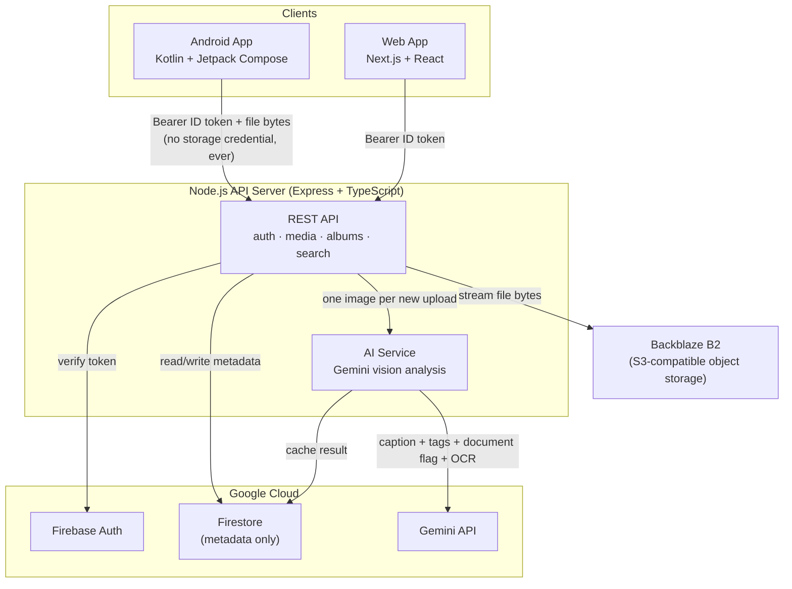

# Photos

**A private, AI-powered photo backup platform** — Android app, API server, and web app — built for the **OOSC 4.0 Hackathon** under the **AI for Public Good** problem statement.

[](https://nodejs.org)
[](https://kotlinlang.org)
[](https://nextjs.org)
[](https://ai.google.dev)
[](LICENSE)

---

## 🚀 Live demo

| | |
|---|---|
| **Web app** | [spirexa.vercel.app](https://spirexa.vercel.app) — or go straight to [**spirexa.vercel.app/test**](https://spirexa.vercel.app/test) for one-click judge access, no typing required |
| **Android app** | [**Download the APK**](https://github.com/UtkarshCodecom/spirexa/releases/download/v1.0.0-demo/app-debug.apk) — pre-configured to talk to the live backend, install and sign in directly, no build step needed |
| **API server** | [spirexa.onrender.com](https://spirexa.onrender.com) (Render free tier — sleeps after 15 min idle, first request may take ~30-60s to wake it up) |
| **Judge login** | `test@gmail.com` / `Utkarsh.1905` — a real seeded account with a genuine, already-backed-up photo library, not a mocked demo state |

The Android app talks to the same live API server — see [server/README.md](server/README.md) for local setup if you want to run it yourself.

## Why this matters

People trust photo apps with some of their most sensitive material — medical records, prescriptions, ID cards, receipts, family photos — often without a second thought about where the data goes or who can read it. **Photos** was built around a simple constraint: **no client, ever, holds a storage credential.** Every byte is proxied through a server that verifies who's asking before it lets them look. On top of that private-by-design foundation, we layered real, working AI — not a bolt-on chatbot, but vision analysis that runs quietly on every photo to make a personal archive genuinely *usable*: searchable by what's actually in a picture, and protective of important documents by catching and organizing them automatically.

That combination — **privacy-first storage** + **accessible, low-cost AI** — is the "public good" bet this project makes: the people who benefit most from an app that finds "that photo of the prescription" without them remembering a filename, or that never quietly leaks a storage key, are the people least equipped to notice when an app *doesn't* do those things.

## What it does

| | |
|---|---|
| 🔒 **Private by construction** | The Android/web clients never see a Backblaze B2 storage credential. Every upload/view/delete is proxied and re-authorized server-side, every time. |
| 🧠 **AI photo search** | Type "beach", "birthday cake", a color, a mood — search matches an AI-generated caption and tags for each photo, not just the filename. |
| 📄 **AI document detection** | The same AI pass flags photos that are actually IDs, receipts, certificates, or forms, transcribes the text (OCR), and files them under a dedicated "Documents" view — so a photographed prescription or ID never gets lost in a camera roll. |
| 🖼️ **Smart, auto-organized albums** | Screenshots, WhatsApp, Camera, Instagram, Telegram, Snapchat — auto-detected from where each photo lives on-device, alongside albums you create yourself. |
| 🕰️ **Memories** | "On this day" and "N months ago" resurfacing, like every major photos app — but computed entirely on-device from your own timeline, no AI cost involved. |
| 📍 **Places** | Photos clustered by where they were taken, from EXIF GPS — read only with your explicit permission. |
| 🔗 **Share links** | Public, no-login share links for a curated set of photos, without ever exposing a real storage URL. |
| 🎨 **Themeable UI** | Ten hand-built neumorphic themes, switchable live. |

## AI: what it actually does, and what it costs

The AI is not decorative. On every photo upload, the server sends a single request to **Gemini 3.5 Flash Lite** (Google's cheapest current multimodal model) and gets back structured JSON:

```json
{
  "caption": "one short sentence describing the photo, for search",
  "tags": ["5-8 short search keywords"],
  "isDocument": true,
  "documentText": "full transcribed text, only if isDocument is true"
}
```

That one response powers **both** search and document detection — deliberately one call, not two, to keep this cheap. As a real example, a photo of a construction site — filename `IMG_20210912_165821.jpg`, no semantic hints at all — came back captioned *"Workers gather rocks and stones at a construction and landscaping site under a blue sky"*, with tags `workers, construction, rocks, site, outdoor, landscape, mountains`. That's the model looking at pixels, not guessing from a filename.

**Cost controls, on purpose:**
- **One Flash-tier call per photo, ever** — analysis result is cached in Firestore; a photo is never re-analyzed.
- **Free at search time** — the client already has the cached captions/tags; typing a query is pure local filtering, zero extra API calls.
- **Bounded backfill** — photos uploaded before the AI pipeline existed get analyzed lazily, in capped batches of 12 per app visit, so opening the Search tab can never trigger an unbounded batch of paid calls on a large library.
- **Optional by design** — the whole pipeline no-ops safely with no `GEMINI_API_KEY` set; nothing else breaks.

**Where the "public good" framing pays off:**
- **Document safety for vulnerable users** — someone who photographs a prescription, an ID, or a hospital receipt (rather than scanning it "properly") gets it automatically found, organized, and made text-searchable — without having to know that feature exists.
- **Accessibility** — natural-language search lowers the bar for anyone who doesn't remember filenames, dates, or folder structures to find a specific memory.
- **Nothing sent to Google except pixels needed for that one analysis** — see [Security](#security) for how the API key itself is protected.

## Architecture



Every file operation — upload, view, delete — is proxied through the server. Neither client ever talks to Backblaze or Google Gemini directly.

## Tech stack

| Layer | Technology |
|---|---|
| **Android** | Kotlin, Jetpack Compose, OkHttp, Coil, WorkManager, DataStore, hand-written `SQLiteOpenHelper` — no Retrofit/Room/Hilt |
| **Server** | Node.js, Express, TypeScript, Firebase Admin SDK, `@aws-sdk/client-s3`, Zod, Helmet, `express-rate-limit`, Pino |
| **Web** | Next.js 15, React 19, TypeScript, Tailwind CSS |
| **Auth** | Firebase Authentication |
| **Database** | Cloud Firestore (metadata only — the media bytes never touch it) |
| **Object storage** | Backblaze B2 (S3-compatible) |
| **AI** | Google Gemini 3.5 Flash Lite (vision + JSON mode) |

## Repository structure

```
Photos/
├── app/                  # Android app — see the code, or the flows below
│   └── src/main/java/com/desire/photos/
│       ├── ui/           # home, albums, places, search, settings, share, auth
│       ├── data/         # local MediaStore access, remote API client, models
│       ├── backup/       # WorkManager background backup pipeline
│       └── di/           # ServiceLocator (manual DI, no Hilt)
├── server/               # API server — see server/README.md
│   └── src/
│       ├── modules/      # auth, media, albums, search, users, shares
│       ├── services/     # storage.service.ts (B2), ai.service.ts (Gemini)
│       ├── middleware/   # auth, rate limiting, validation
│       └── config/       # env, Firebase init, outbound proxy handling
├── web/                  # Next.js web app — see web/README.md
├── packages/types/       # Shared TypeScript types (server ⇄ web)
├── firebase/             # Firestore/Storage security rules
└── docker-compose.yml
```

## Quick start

```bash
git clone <this-repo-url>
cd Photos
npm install
cp server/.env.example server/.env   # fill in Firebase + B2 + Gemini credentials
npm run dev:server                   # http://localhost:3002
npm run dev:web                      # http://localhost:3000
```

Then open the `app/` project in Android Studio, point `local.properties`'s `API_BASE_URL` at your running server, and run it on a device or emulator.

Full setup, environment variables, and API reference live in **[server/README.md](server/README.md)**. Web-specific setup is in **[web/README.md](web/README.md)**.

## Security

- **No client ever holds a storage credential.** The Backblaze B2 key exists only in the server's process environment.
- Every request is authenticated with a Firebase ID token, verified server-side; the user ID is taken from the *verified* token, never from anything the client sends.
- Every resource access re-checks ownership against Firestore before returning data — a valid token for user A can never read user B's media.
- Media content URLs carry short-lived (15-minute), server-signed, single-item tokens instead of a shared secret or a direct storage URL.
- The **Gemini API key never reaches a client** — image analysis happens entirely server-side; the client only ever sees the resulting caption/tags/OCR text, never the key.
- Rate limiting (general, auth, upload, search), Zod-validated inputs, Helmet security headers, CORS restricted to configured origins.
- No secrets committed to the repository — every `.env*` is gitignored; see `server/.env.example` for what's needed.

See **[server/README.md](server/README.md#security)** for the full threat-model-level detail.

## Problem statement

**AI for Public Good** — a privacy-first photo archive that uses AI to make itself more accessible and more protective of the documents its most vulnerable users are most likely to lose track of, at a bounded, near-zero marginal AI cost per user.

## License

MIT — see [LICENSE](LICENSE).
