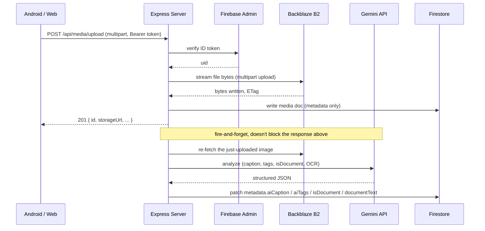

# Photos — API Server

The API server is the only piece of this system that holds real credentials — the Backblaze B2 storage key, the Firebase Admin service account, and the Gemini API key all live here and nowhere else. Both clients (Android, web) talk to it exclusively over authenticated HTTP; neither ever talks to Backblaze or Gemini directly.

## What it does

1. **Authenticates** every request with a Firebase ID token.
2. **Streams** photo/video bytes straight through to Backblaze B2 — never buffered fully in memory, never written to local disk.
3. **Analyzes** each newly uploaded image with Gemini (caption, search tags, document detection, OCR) in the background, without slowing down the upload response.
4. **Stores** metadata (never the file bytes) in Firestore, scoped per-user.
5. **Serves** files back with HTTP Range support (video scrubbing, partial image loads) through either a Bearer token or a short-lived signed URL.

## Architecture



## Setup

### Prerequisites
- Node.js 20+
- A Firebase project (Firestore + Authentication enabled)
- A Backblaze B2 bucket + Application Key (or any S3-compatible bucket)
- A free Gemini API key from [Google AI Studio](https://aistudio.google.com/apikey) — optional; AI features simply no-op without one

### Environment variables

```bash
cp .env.example .env
```

| Variable | Required | Notes |
|---|---|---|
| `FIREBASE_PROJECT_ID` / `FIREBASE_CLIENT_EMAIL` / `FIREBASE_PRIVATE_KEY` | Yes | Firebase console → Project settings → Service accounts → Generate new private key |
| `B2_BUCKET` / `B2_ENDPOINT` / `B2_REGION` / `B2_KEY_ID` / `B2_APPLICATION_KEY` | Yes | Any S3-compatible provider works — just point `B2_ENDPOINT` at it |
| `CONTENT_TOKEN_SECRET` | Production only | Signs short-lived media URLs; a random dev-only secret is generated automatically otherwise |
| `GEMINI_API_KEY` | No | Blank disables AI analysis entirely — everything else still works |
| `GEMINI_MODEL` | No | Defaults to `gemini-3.5-flash-lite` |
| `MAX_FILE_SIZE_BYTES` / `DEFAULT_QUOTA_BYTES` | No | Per-upload cap / per-user total storage cap. Defaults: 200 MB / 15 GB |
| `CORS_ORIGIN` | No | Restrict which web origins may call this API |
| `RATE_LIMIT_WINDOW_MS` / `RATE_LIMIT_MAX` | No | General rate limit window/count |

### Run

```bash
npm install
npm run dev        # tsx watch, http://localhost:3002 by default
npm run build       # tsc → dist/
npm start           # node dist/server.js
npm run typecheck
```

## The AI pipeline, in detail

**Trigger.** `media.service.ts`'s `uploadMedia()` fires `analyzeAndStore()` after the upload response has already been sent — analysis latency never adds to perceived upload time.

**The call.** `services/ai.service.ts`'s `analyzePhoto()` sends one request to `generativelanguage.googleapis.com` with:
- `inlineData`: the image, base64-encoded
- A prompt instructing the model to return **only** JSON: a one-sentence caption, 5–8 lowercase tags, an `isDocument` boolean, and (only if `isDocument`) the transcribed text
- `generationConfig.responseMimeType: "application/json"` and a `maxOutputTokens` cap, to keep every response small and cheap

**Storage.** The result is written via `mediaRepository.updateAiMetadata()` — a Firestore dot-notation partial update (`metadata.aiCaption`, `metadata.aiTags`, `metadata.isDocument`, `metadata.documentText`) so it merges into the existing metadata map instead of overwriting sibling fields like `dateTaken` or `location`.

**Backfill.** `POST /api/media/:id/analyze` lets a client request on-demand analysis for a photo that predates the pipeline. It's **idempotent** — a photo that already has a caption is returned unchanged rather than re-analyzed, so a buggy or repeated client call can't rack up repeat Gemini cost. The Android client uses this to catch up an existing library in capped batches of 12 photos per Search-tab visit rather than all at once.

**Search.** There is deliberately **no server-side search endpoint for this** — the client already fetches the full media list (with cached captions/tags) for its own UI, so query matching happens entirely client-side, for zero marginal cost per search.

## Security

### Authentication & authorization
- Every request except `/api/health` and the public share-link endpoint requires `Authorization: Bearer <Firebase ID token>`, verified against Firebase Admin SDK on every call — not cached, not trusted from a prior request.
- The user ID used for every database query and storage path comes from the **verified token's `uid` claim** — a client can never claim to be a different user by sending a different ID in the body.
- Every media/album operation re-checks `ownerId === uid` against the Firestore document before allowing read or write — a stolen or forged request for someone else's `mediaId` is rejected regardless of what token it carries, as long as the token belongs to a different user.

### Storage credential isolation
- The B2 Application Key is read once from `server/.env` into the S3 client at startup and never serialized into any HTTP response, header, or log line.
- Uploads and downloads both stream through the server (`storage.service.ts`) — no presigned B2 URL is ever handed to a client. This trades some server egress bandwidth for the guarantee that a leaked API response never leaks a storage credential.

### Content access tokens
- `GET /api/media/:id/content` (used for ``/video tags, which can't attach an `Authorization` header) accepts a short-lived, HMAC-signed `?token=` parameter instead.
- Each token is scoped to exactly one `(uid, mediaId)` pair, expires in 15 minutes (`utils/contentToken.ts`), and is verified only by this server — it is not a storage credential, and leaking one URL exposes exactly one photo for 15 minutes, nothing else.

### AI key isolation
- `GEMINI_API_KEY` lives only in server memory; the client never sees it, never calls Gemini directly, and only ever receives the *result* (caption/tags/OCR text) of an analysis this server performed.
- The image bytes sent to Gemini are the minimum needed for one analysis call — no bulk export, no persistent third-party copy beyond Google's own API-level retention.

### Input validation & abuse prevention
- All JSON request bodies are validated with Zod schemas (`validators/`) before touching business logic.
- `express-rate-limit` applies per-route: a general limiter on every request, a tighter one on auth, upload, and search endpoints specifically.
- Upload size is checked twice — once against the client's declared size, and again against the actual byte count Backblaze reports it received, so a client can't under-report size to bypass a quota check.
- `helmet` sets standard security headers (CSP, no-sniff, frame-ancestors, HSTS, etc.); CORS is restricted to `CORS_ORIGIN`.

### Secrets hygiene
- `.gitignore` excludes every `.env*` file at every level of the repo; `.env.example` files contain empty placeholders only.
- Firestore/Storage security rules (`firebase/`) are the last line of defense if a client ever obtained a Firebase Auth token directly (they still can't read another user's subcollection).

## Firestore structure

```
users/{uid}
  ├── uid, email, displayName, photoURL, storageUsedBytes, createdAt, updatedAt
  ├── media/{mediaId}
  │   ├── ownerId, fileName, mimeType, size, storagePath (real B2 key — never sent to clients)
  │   ├── width, height, description, favorite, deleted, deletedAt
  │   ├── metadata: { dateTaken, location, aiCaption, aiTags, isDocument, documentText }
  │   └── createdAt, updatedAt
  └── albums/{albumId}
      ├── ownerId, title, description, coverMediaId, mediaCount
      └── media/{mediaId}   ← album membership subcollection

shares/{shareId}   ← top-level; public share links have no uid to scope under
```

## Backblaze B2 object key structure

```
{uid}/{mediaId}_{sanitizedFileName}
```

## API reference

All routes are mounted under `/api`. Auth column: **P**ublic, **B**earer token required.

### Health
| Method | Path | Auth | Description |
|---|---|---|---|
| GET | `/health` | P | Liveness check |

### Auth
| Method | Path | Auth | Description |
|---|---|---|---|
| GET | `/auth/me` | B | Current user's decoded token claims |

### Users
| Method | Path | Auth | Description |
|---|---|---|---|
| GET | `/users/me` | B | Profile |
| GET | `/users/me/quota` | B | `{ usedBytes, limitBytes }` |
| PATCH | `/users/me` | B | Update profile |
| DELETE | `/users/me` | B | Delete account |

### Media
| Method | Path | Auth | Description |
|---|---|---|---|
| POST | `/media/upload` | B | Multipart upload, streamed straight to B2 |
| GET | `/media/:id/content` | B or signed `?token=` | Stream file bytes, Range-aware |
| GET | `/media` | B | Paginated list (`?limit=&cursor=&favorite=&deleted=`) |
| GET | `/media/:id` | B | Single item |
| PATCH | `/media/:id` | B | Update `fileName`, `description`, `metadata.dateTaken`, `metadata.location` |
| POST/DELETE | `/media/:id/favorite` | B | Toggle favorite |
| POST | `/media/:id/analyze` | B | Trigger AI analysis (idempotent) |
| POST | `/media/:id/trash` | B | Soft delete |
| POST | `/media/:id/restore` | B | Restore from trash |
| DELETE | `/media/:id/permanent` | B | Permanently delete (B2 object + Firestore doc + quota adjustment) |

### Albums
| Method | Path | Auth | Description |
|---|---|---|---|
| GET/POST | `/albums` | B | List / create |
| GET/PATCH/DELETE | `/albums/:id` | B | Read / update / delete |
| GET/POST | `/albums/:id/media` | B | List members / add members |
| DELETE | `/albums/:id/media/:mediaId` | B | Remove one member |

### Search
| Method | Path | Auth | Description |
|---|---|---|---|
| GET | `/search?q=...` | B | Filename search (AI caption/tag search is client-side — see above) |

### Shares
| Method | Path | Auth | Description |
|---|---|---|---|
| GET | `/shares/:id` | P | Public, no-login view of a shared set of photos |
| GET | `/shares` | B | List my share links |
| POST | `/shares` | B | Create a share link for a set of media IDs |
| DELETE | `/shares/:id` | B | Revoke a share link |

## Docker

```bash
docker-compose up --build
```

`docker-compose.yml` expects the same environment variables listed above, either exported or in a root `.env` picked up by Compose.
